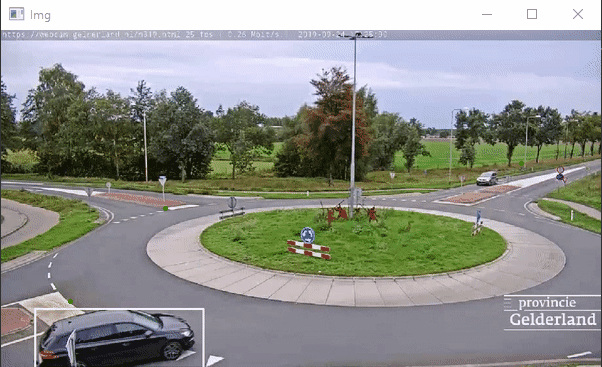

# CV-CarTracker

# Description 
This program uses the YOLOv5 library to detect cars and track their speeds in real time. 3 landmarks have been designated in the program, with the distance between each measured on Google Maps. The time at which a car passes a landmark is recorded and then compared to the time at which they pass the next landmark, the speed of that car is then calculated.

The main file handles all of the OpenCV operations, such as tracking the cars and displaying their speeds above the point they most recently passed. Car.py stores information for each car that passes the camera, such as the time at which they passed a landmark, as well as their coordinates and speeds. 

# Demo

In the demo we are only tracking and displaying the speed of the silver car from the upper portion of the screen.

# Tech
Project Developed with:
* OpenCV
* YOLOv5
* Python 3
* Numpy
* Torch
